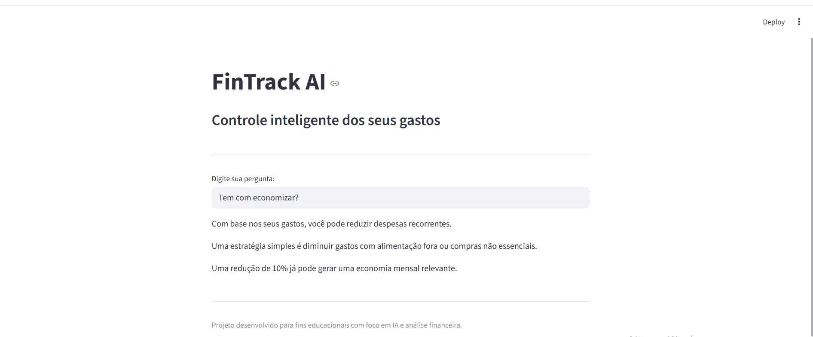

# FinTrack AI

Agente financeiro inteligente desenvolvido com IA generativa, focado em análise de gastos, simulações financeiras e apoio à tomada de decisão.

## Preview


---

## Sobre o Projeto

O FinSmart AI é um assistente financeiro que utiliza linguagem natural para ajudar usuários a entender melhor sua vida financeira.

O projeto foi desenvolvido com foco em um cenário real: um profissional da área hospitalar, com rotina intensa e necessidade de maior controle financeiro.

---

## Objetivo

Ajudar o usuário a:

* Entender para onde seu dinheiro está indo
* Identificar padrões de consumo
* Receber sugestões práticas de economia
* Simular cenários financeiros
* Tomar decisões mais conscientes

---

## Funcionalidades

* Análise automática de gastos
* Sugestões personalizadas com base no perfil
* Simulações de economia mensal
* FAQ financeiro inteligente
* Respostas em linguagem natural
* Uso de dados reais (CSV e JSON)

---

## Estrutura do Projeto

```
lab-agente-financeiro/
│
├── data/
│   ├── transacoes.csv
│   ├── historico_atendimento.csv
│   ├── perfil_investidor.json
│   └── produtos_financeiros.json
│
├── docs/
│   ├── 01-documentacao-agente.md
│   ├── 02-base-conhecimento.md
│   ├── 03-prompts.md
│   ├── 04-metricas.md
│   └── 05-pitch.md
│
├── src/
│   └── app.py
│
└── README.md
```

---

## Tecnologias Utilizadas

* Python
* Streamlit
* Pandas
* IA Generativa (simulada)

---

## Como Executar o Projeto

1. Clone o repositório ou extraia os arquivos

2. Instale as dependências:

```
pip install streamlit pandas
```

3. Execute a aplicação:

```
streamlit run src/app.py
```

---

## Exemplo de Uso

Pergunta:
"Gastei muito esse mês?"

Resposta:
"Você gastou R$ 3.200, equivalente a 91% da sua renda estimada. O maior gasto foi com alimentação."

---

## Segurança

O projeto segue boas práticas para evitar erros de IA:

* Não inventa dados
* Usa apenas base real
* Informa quando não há dados suficientes
* Evita recomendações financeiras arriscadas

---

## Diferenciais

* Aplicação em cenário real
* Foco em experiência do usuário
* Uso de dados estruturados
* Arquitetura simples e escalável
* Pronto para evolução com APIs de IA reais

---

## Próximos Passos

* Integração com APIs de IA generativa (como OpenAI ou Gemini) para respostas mais avançadas
* Implementação de entrada e saída por voz para melhorar a experiência do usuário
* Aprimoramento da interface com visualização de dados (gráficos de gastos)
* Evolução do modelo de análise com maior personalização baseada no perfil do usuário

Este projeto foi estruturado desde o início para permitir evolução incremental, facilitando a integração de novas funcionalidades conforme o avanço do desenvolvimento.


---

## Autor

 

Marcelo Camargo Siqueira

Estudante de Sistemas de Informação com foco em desenvolvimento backend, inteligência artificial e soluções baseadas em dados.
 

Este projeto foi desenvolvido como parte de um desafio prático, com o objetivo de consolidar conhecimentos em IA generativa, experiência do usuário e desenvolvimento de aplicações.

Buscando oportunidade como desenvolvedor júnior para aplicar e evoluir essas habilidades em ambiente profissional.

  

  
